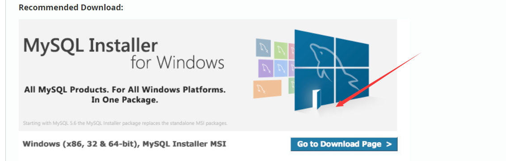
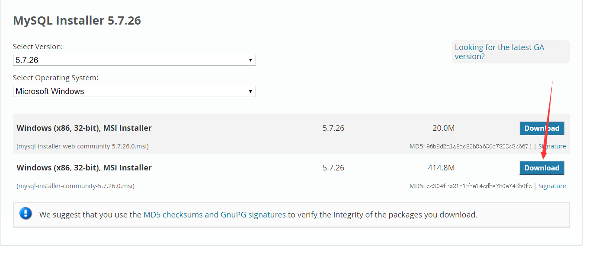
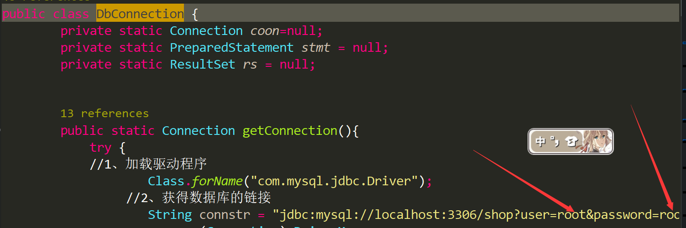
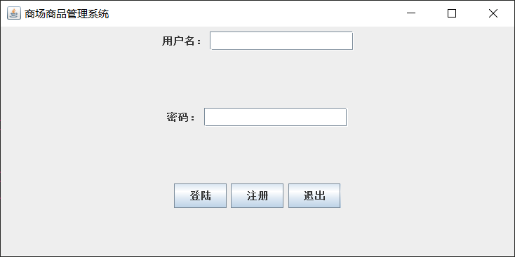
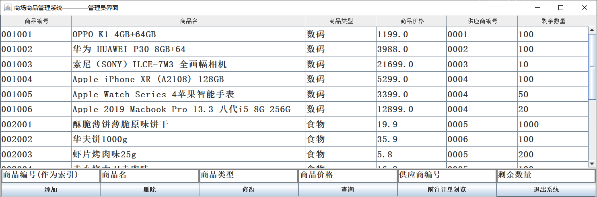
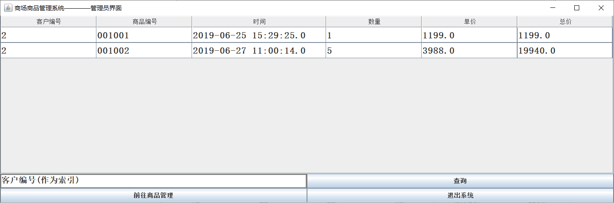
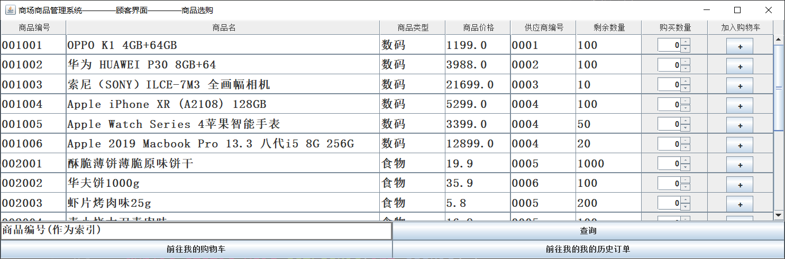
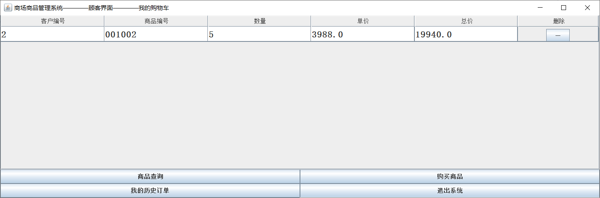
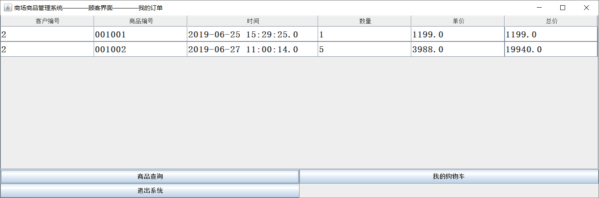

# ShopMannage
a easy java gui design with mysql (school class design) 

# 					商场商品管理系统

#### 商场商品管理系统 V1.0

> - 商场商品管理系统是一个使用Java+mysql开发的Gui界面的系统
> - 前端界面使用java开发的gui 界面略微粗糙 主要netBeans不熟 Orz 使用的IDE为myEclipse
> - 后端使用轻量级的mysql作为数据库
> - 该系统具有较好平台可移植性

##### 配置需求

1. 下载mysql数据库<https://dev.mysql.com/downloads/mysql/5.7.html#downloads>
   
   
   安装步骤<https://zhuanlan.zhihu.com/p/37152572>

2. 如果需要可视化界面 可以使用navicat进行mysql数据库管理

   <https://blog.csdn.net/AinUser/article/details/81415253>

3. 运行代码需要先安装jdbc驱动（如果eclipse可仿照）

   <https://jingyan.baidu.com/article/86f4a73e8ae74337d65269ea.html>

   <https://blog.csdn.net/Grand910616/article/details/52599782>

4. 将shop.sql导入到mysql数据库

   https://jingyan.baidu.com/article/a24b33cd2de7e219ff002b6b.html

5. 安装完成 用IDE(如eclipse)打开 

   

   先修改pubClass/DbConnection代码（23行位置）
   
   

​       用户名密码修改为自己mysql的账号密码

##### 运行测试
1. shop/Login.java 运行

> 测试账号为 admin/admin 管理员
>
> ​                    test/test          普通用户

  

2. 管理员界面

3. 顾客界面

#### 未完待续

> 界面以及部分功能细节需要后续更新，敬请期待V2.0

#### 附系统需求：

>**商场商品管理系统**
>
>要求： 
>
>1） 该系统主要处理商场中的商品信息。 
>
>2） 商品信息主要包括：商品编号、商品类型、商品类型、价格、供应商、数量等内容。
>
>3） 供应商信息主要包括：供应商编号、供应商名称、联系电话等内容。 
>
>4） 用户分为两类：客户和管理员。可以注册为任意类型的用户，用户必须通过正确的用户名和密码登录系统后才能使用系统的功能。
>
>5） 客户和管理员可以浏览、查询商品。 
>
>6） 客户可以购买商品：首先选择商品加入购物车，在购物车中点击确定，形成订单，一条订单信息包含客户编号、商品编号、购买数量、购买时间等。
>
>7） 客户可以浏览自己的订单信息。 
>
>8） 管理员可以修改商品信息，可以浏览、查询全部用户的订单信息。
>
>提示：
>
>1) 增加必要的数据成员、成员函数或类 
>
>2) 使用继承、对象成员（供应商） 
>
>3) 购物过程（购物车）可以借鉴淘宝的购物过程
>
>4）设计合理的数据库及数据表存储信息
